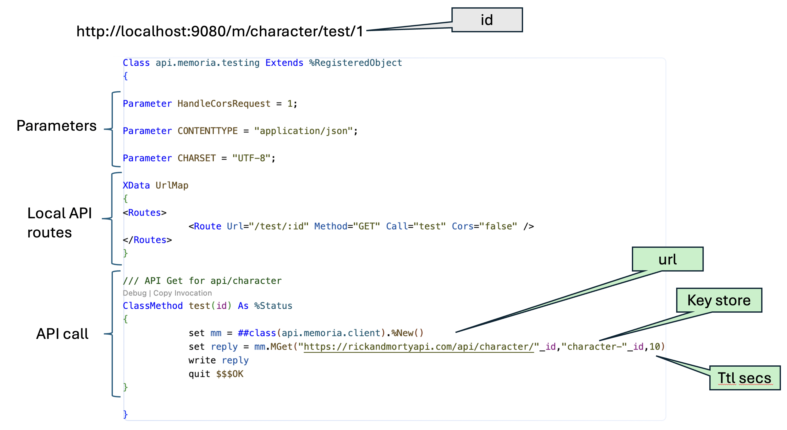
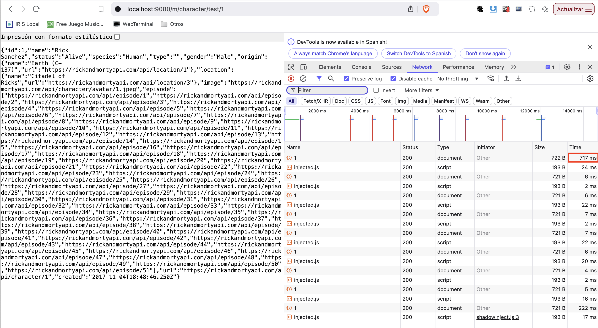
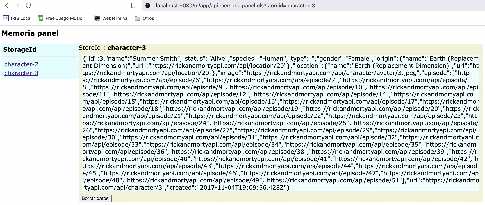

# Memoria
## just an API accelerator

This application allows you to cache the result of a GET API call permanently or for a period of time, reducing response times to the end client.

In the example below, the Rick & Morty public API is used to make several queries to the server. Each query on its own and using the home internet connection takes around 300 ms. When using the accelerator, the response time is around 7 ms.

## Client

The *memoria.client* class is responsible for calling the MGet method, this method executes the call to the external API but first validates if the information of this API is cached in the memoria.store table, if so, it validates that it is within the configured Time to Live (TTL) and returns the data, if the TTL has expired, it deletes the information and generates the call, stores the result and returns it to the program.

***For a statics API, i.e. countries list, cities name, etc. I recomend to use TTL=0, to maintain in store the list.***

## API Result

in the first call (red square on top) the time for the call was **722ms** and all the other calls the time was around **7ms**, on this case just a 1% of the original time.

After 10 seconds (ttl value) the time growth to **220ms**

## Panel

The Panel is a small application that allows you to manage cached data and delete it if necessary.

